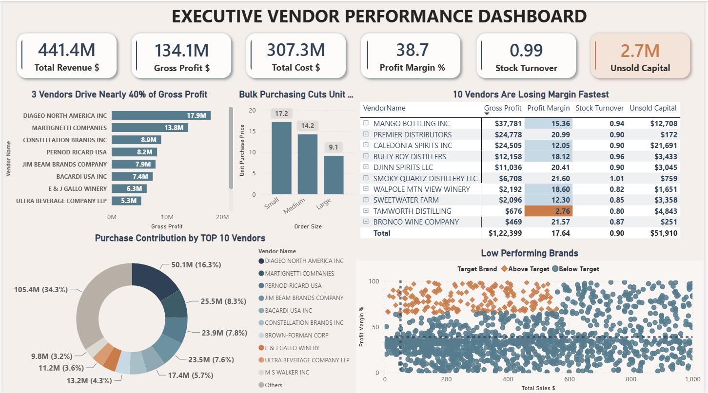

# 📊 Retail Vendor Inventory Analytics

<p align="center">


</p>

An end-to-end retail inventory and vendor performance analytics project that builds a SQLite database from raw transactional data, performs exploratory and statistical analysis in Python, and presents executive-level insights through an interactive Power BI dashboard.

---

# 📷 Dashboard Preview

<p align="center">

</p>

---

# 🎥 Dashboard Walkthrough

<p align="center">

</p>

---

# 🧩 Business Problem

Retail and wholesale companies must optimize purchasing, inventory, and vendor relationships to maximize profitability. Poor purchasing decisions, slow inventory movement, and dependence on a few vendors increase holding costs and reduce operational efficiency.

## Objectives

- Identify underperforming brands requiring pricing or promotional changes.
- Determine vendors contributing the highest revenue and gross profit.
- Measure the effect of bulk purchasing on unit cost.
- Assess inventory turnover and unsold capital.
- Compare profitability between high-performing and low-performing vendors.

---

# 🏗️ Project Workflow

```text
Raw CSV Files
      │
      ▼
Python ETL (ingestion_db.py)
      │
      ▼
SQLite Database
      │
      ▼
Vendor Summary Generation
(get_vendor_summary.py)
      │
      ▼
Exploratory Data Analysis
      │
      ▼
Statistical Analysis
      │
      ▼
Power BI Executive Dashboard
```

---

# 🛠️ Technology Stack

| Category | Tools |
|-----------|------|
| Programming | Python |
| Libraries | Pandas, NumPy, Matplotlib, SciPy |
| Database | SQLite |
| Analytics | Jupyter Notebook |
| BI Tool | Power BI Desktop |

---

# 📁 Repository Structure

```text
retail-vendor-inventory-analytics/
│
├── dashboard/
│   └── vendor_performance_dashboard.pbix
├── screenshots/
│   ├── Dashboard.png
│   └── dashboard_demo.gif
├── scripts/
│   ├── ingestion_db.py
│   └── get_vendor_summary.py
├── 01_exploratory_data_analysis.ipynb
├── 02_vendor_performance_analysis.ipynb
└── README.md
```

---

# 📈 Dashboard Highlights

- Executive KPI cards
- Vendor profitability analysis
- Gross profit ranking
- Purchase contribution analysis
- Bulk purchase cost analysis
- Lowest-performing vendors
- Inventory turnover analysis
- Brand performance analysis

---

# 🔍 Key Insights

- Bulk purchasing reduces average unit cost.
- Vendor concentration creates dependency risk.
- Low inventory turnover ties up working capital.
- Statistical testing confirms significant profitability differences.

---

# 🚀 Future Improvements

- Time-series analysis
- Automated ETL
- Power BI Service deployment
- Forecasting
- Drill-through pages

---

# 👨‍💻 VIRENDER BENIWAL

<p align="center">

<a href="[www.linkedin.com/in/virender-beniwal47](https://www.linkedin.com/in/virender-beniwal47/)">

</a>

<a href="https://github.com/virenderwayahead">

</a>

<a href="mailto:virenderbeniwal709@gmail.com">

</a>

</p>

